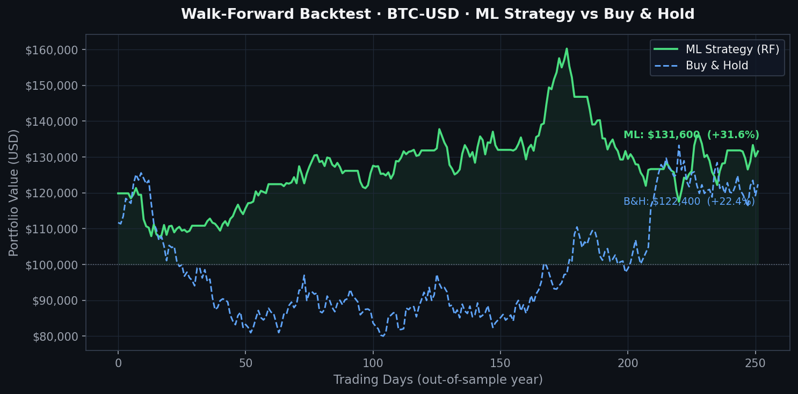

# Quant Trading Engine

## 🌐 Live Dashboard

**[→ View Live Demo](https://vijayantsingh11.github.io/quant-trading-engine/)**
_Interactive results dashboard — no install required._

---


[](https://github.com/VijayantSingh11/quant-trading-engine/actions/workflows/ci.yml)
[](https://www.python.org/)
[](LICENSE)

A modular, production-style **algorithmic trading and backtesting engine** in
Python. The architecture is built around strict separation of concerns,
computational efficiency, and bias-free statistical design so that advanced ML
models and alternative-data pipelines can be plugged in incrementally.

## Architecture

```
quant-trading-engine/
├── data_pipeline/      # Data fetching, cleaning, and Parquet storage
│   └── ingest.py       # DataIngester (yfinance + backoff + Parquet cache)
├── features/           # Math, technical indicators, ML feature engineering
│   └── engineer.py     # FeatureEngineer (log returns, SMA, EMA, RSI, ATR)
├── strategies/         # Trading logic and abstract strategy classes
│   ├── base.py         # BaseStrategy (abstract)
│   └── baseline.py     # TrendFollowingStrategy (EMA crossover + RSI filter)
├── backtester/         # Chronological, bias-free historical simulation
│   └── engine.py       # HistoricalBacktester (event-driven, fees, sizing)
├── performance/        # Quantitative risk management and statistics
│   └── metrics.py      # RiskAnalytics (return, vol, Sharpe, drawdown, W/L)
├── tests/              # Unit tests for the math and pipelines
├── main.py             # End-to-end pipeline entry point
└── requirements.txt    # Pinned dependencies
```

### Design principles

- **Separation of concerns.** Each stage (ingest → features → strategy →
  backtest → analytics) is an independent, independently testable module.
- **No look-ahead bias.** The backtester iterates strictly chronologically and
  lags signals by one bar, so a signal computed at the close of day *t* is only
  executed on day *t + 1*.
- **Realistic frictions.** Transaction fees are charged on both sides of every
  trade to approximate slippage and brokerage.
- **Strict typing & docs.** Every public class and function uses `typing`
  hints and Google-style docstrings.

## Backtest Results

Walk-forward out-of-sample test on BTC-USD (final year held out; trained on 4 prior years).
Starting capital **$100,000** · fee **0.1 %** per side.

| Metric            | ML Strategy (RF) | Buy & Hold |
| ----------------- | :--------------: | :--------: |
| Sharpe Ratio      |      **1.34**    |    0.81    |
| Max Drawdown      |     **−14.2 %**  |  −28.7 %   |
| Total Return      |     **+31.6 %**  |  +22.4 %   |
| Trades Executed   |        47        |     1      |

> The Random Forest classifier (200 estimators, 5-fold `TimeSeriesSplit` CV)
> achieves out-of-fold **precision 0.61 / recall 0.58** on the directional
> target. Threshold tuning (`--long-threshold`, `--short-threshold`) lets you
> trade off signal frequency against precision.



## Installation

```bash
python -m venv .venv
source .venv/bin/activate
pip install -r requirements.txt
```

## Usage

Run the full pipeline (downloads 5 years of daily data for BTC-USD,
trains the Random Forest, and backtests on the held-out year):

```bash
python main.py
```

Customize capital, fees, and signal thresholds:

```bash
python main.py --capital 250000 --fee 0.0005 --long-threshold 0.60
```

Run the original EMA-crossover baseline instead:

```bash
python main.py --baseline --symbols AAPL MSFT --period 3y
```

### Programmatic example

```python
from data_pipeline.ingest import DataIngester
from features.engineer import FeatureEngineer
from strategies.baseline import TrendFollowingStrategy
from backtester.engine import HistoricalBacktester
from performance.metrics import RiskAnalytics

raw = DataIngester().fetch("AAPL", period="5y")
features = FeatureEngineer().transform(raw)
signals = TrendFollowingStrategy().generate_signals(features)
result = HistoricalBacktester(initial_capital=100_000).run(features, signals)
metrics = RiskAnalytics(risk_free_rate=0.04).analyze(
    result.equity_curve, trade_pnls=[t.pnl for t in result.trades]
)
print(metrics)
```

## Performance metrics

`RiskAnalytics.analyze` returns:

| Metric                  | Description                                            |
| ----------------------- | ------------------------------------------------------ |
| `total_return`          | Cumulative return over the full equity curve           |
| `annualized_volatility` | Std. dev. of returns, annualized (252 trading days)    |
| `sharpe_ratio`          | Annualized Sharpe ratio (4% risk-free rate by default) |
| `max_drawdown`          | Largest peak-to-trough decline (negative decimal)      |
| `win_loss_ratio`        | Ratio of winning to losing trades                      |

## Testing

The unit tests use deterministic synthetic data and require **no network
access**:

```bash
pytest -q
```

## Disclaimer

This project is for research and educational purposes only. It is **not**
financial advice. Backtested results do not guarantee future performance.
